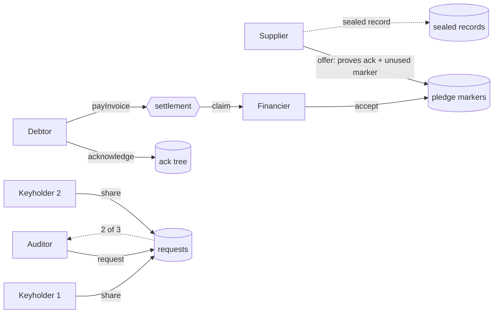

<!-- SPDX-License-Identifier: Apache-2.0 -->

# Stock & Foil

**A collateral registry that proves things it cannot read.** Suppliers pledge invoices, financiers
check them, and the register refuses a forged, an inflated or a second pledge of the same invoice —
while the public ledger holds nothing but commitments, one-time markers and sealed records.

Built on [Midnight](https://midnight.network) in Compact. Named after the medieval exchequer tally:
a stick notched with a debt and split in two, the **stock** kept by the lender and the **foil** by
the debtor. Halves that don't match are a forgery, and a stick already split cannot be split again.

---

## The problem

Receivables finance loses billions to three frauds that look identical on paper:

| Fraud | What happens | Stock & Foil |
|---|---|---|
| **Forged invoice** | Financing raised against an invoice the buyer never owed | `NOT_ACKNOWLEDGED` |
| **Inflated invoice** | The buyer owes $2,300; the financier is shown $23,000 | `NOT_ACKNOWLEDGED` |
| **Double pledge** | One invoice financed by several financiers at once | `ALREADY_ENCUMBERED` |
| **Diverted proceeds** | The buyer pays, the supplier keeps the cash | proceeds are claimable only by the pledge holder |

In September 2025 First Brands filed for Chapter 11 owing roughly **$2.3 billion** in
receivables-finance liabilities, with invoices alleged to have been forged, inflated tenfold and
presented to more than one financier ([Global Trade Review](https://www.gtreview.com/news/americas/first-brands-accuses-founder-of-receivables-and-inventory-finance-fraud/)).
Financiers cannot cross-check each other today, because sharing invoice data hands client lists and
pricing to competitors — and a central fingerprint registry asks everyone to trust one operator
with all of it.

Midnight's dual ledger removes the trade-off. The checks run in zero knowledge against private
state; the public ledger sees only what it needs to enforce uniqueness.

## How it works

Four parties, one registry contract, twelve circuits.

1. **The buyer acknowledges.** The debtor proves membership of the registry anonymously and writes
   one leaf into an acknowledgment tree — a commitment to the exact invoice: buyer, supplier,
   number, amount, due date and a secret salt. A second acknowledgment of the same invoice number
   is refused.
2. **The supplier offers.** In one proof the supplier shows that the invoice is theirs, that this
   exact invoice was acknowledged by the buyer (so a forged or inflated one has no leaf), that its
   one-time marker is unused (so it isn't already pledged), and that the offer expires before the
   invoice is due. The same circuit seals the pledge record to the registry's disclosure key.
3. **The financier accepts.** The financier proves membership anonymously and that the offer was
   addressed to it, using a fresh per-pledge tag that cannot be linked to its other pledges.
4. **Settlement runs through the contract.** The buyer pays the registry; the money is claimable by
   the pledge holder, not the supplier. A settled invoice can never be pledged again.

Two more mechanisms complete it:

- **Borrowing-base certificate.** A supplier proves to one lender that a pool of up to four
  acknowledged, unencumbered, current receivables clears a floor — and locks exactly those invoices
  to that lender in the same transaction. The lender learns the floor, never the line items.
- **Disclosure that nobody can do alone.** Every pledge record is sealed to a key split 2-of-3
  between keyholders (operator, court, regulator). An auditor requests one record on-chain; two
  keyholders each publish a decryption share, sealed to the auditor, proved correct in-circuit. The
  opened record recomputes the ledger's own marker, so a doctored disclosure fails. No single party
  can read a record, and no record can be read without the request being public.



## What the ledger shows, and what it never shows

| On the public ledger | Never on the ledger |
|---|---|
| Acknowledgment leaves (one per acknowledged invoice) | The invoice: buyer, supplier, number, amount, due date |
| Pledge markers and status (offered / pledged / released / settled) | Which invoice a marker belongs to |
| Per-pledge holder tags | Which financier holds which pledge, or how big its book is |
| Sealed records and their ephemeral keys | The record contents, without 2 of 3 keyholders |
| Certificate floors, pool size, validity | The receivables inside a borrowing base |
| Disclosure requests and approvals | Anything the auditor learns, to anyone else |
| Settlement amounts and addresses (unshielded) | — see *Honest limits* |

A financier who is refused learns exactly one bit: this receivable is already encumbered. Not by
whom, not for how much, not since when.

## Try it

- **[stock-and-foil.vercel.app/app/replay](https://stock-and-foil.vercel.app/app/replay)** — press
  *Run the rest*. Seventeen steps against the real compiled circuits, in your browser tab: no wallet,
  no install, and the three frauds refused in front of you.
- **[What the chain sees](https://stock-and-foil.vercel.app/app/ledger)** · **[the workspaces](https://stock-and-foil.vercel.app/app/seller)** · **[the evidence](https://stock-and-foil.vercel.app/proof)** · **[the deck](https://stock-and-foil.vercel.app/deck)**
- **On a public network:** [PROOF.md](./PROOF.md) has the deployed contract on Midnight preview,
  every transaction with explorer links, and the one command that re-verifies them.
- **In five minutes:** [JUDGES.md](./JUDGES.md).

```bash
npm install
npm test                       # contract + SDK suites, no Docker needed
npm run -w contract compile    # rebuild the circuits with proving keys (needs Docker)
npm run -w cli scenario -- --network preview   # full lifecycle on a public network
npm run -w cli verify -- --network preview     # re-check the chain against the recorded evidence
```

## Repository

```
contract/   Compact contract, witnesses, simulator test suite (see contract/README.md)
sdk/        role clients over two interchangeable backends: in-process simulator and midnight-js
cli/        key ceremony, staged deployment, the evidence scenario, on-chain verification
web/        landing page and the app: guided replay, ledger explorer, persona workspaces
docs/       architecture, threat model, privacy boundary
```

## Testing

| Suite | What it covers |
|---|---|
| `contract/test/lifecycle.test.ts` | happy path for every circuit |
| `contract/test/refusals.test.ts` | one scenario per refusal code, plus lying-witness attacks |
| `contract/test/model.property.test.ts` | random lifecycles against a reference model (fast-check) |
| `contract/test/disclosure.test.ts` | 2-of-3 decryption, with single-share and wrong-key negative controls |
| `sdk/test/*` | record codec, key ceremony, the full scenario through the role clients |
| `sdk/test/network.devnet.test.ts` | deploy and transact with real proofs on a local node (`DEVNET=1`) |

Counts and the live evidence are in [PROOF.md](./PROOF.md).

## Honest limits

- A buyer who colludes with a supplier can still acknowledge an invoice that does not exist. The
  registry makes that acknowledgment non-repudiable; it does not prevent it.
- Settlement is in an unshielded token, so amounts and payer/payee addresses are public at payment
  time. Contract custody of shielded coins is blocked upstream ([servicedesk#187](https://github.com/midnightntwrk/servicedesk/issues/187)).
- The timing of an acknowledgment and a later offer can be correlated by an observer.
- The operator is trusted to admit participants; disclosure keys are dealt by a ceremony rather than
  generated by a distributed protocol, and two colluding keyholders could open a record off-chain
  without a public request.
- A borrowing-base certificate publishes the markers of the invoices it locks — that is what makes
  the lock verifiable.
- Record sealing uses Poseidon masks, which the platform does not promise to keep stable across
  upgrades; records carry a version for that reason.
- Deployed to a public test network only: mainnet contract deployment on Midnight is gated by the
  Foundation's review process.
- Not audited.

## Roadmap

- **Next:** fee sponsorship so participants need no DUST, in-browser proving through 1AM, batch
  acceptance, distributed key generation for the disclosure key, bulk disclosure for insolvency.
- **After that:** ledger-9 migration for contract events and ECDSA-signed e-invoices straight from
  ERP systems, shielded settlement once contract custody lands, a mainnet deployment request, and an
  adapter for existing factoring platforms.

## Built with

[Midnight](https://midnight.network) · Compact 0.31.1 (language 0.23) · compact-runtime 0.16.0 ·
midnight-js 4.1.1 · Midnight wallet SDK 1.2.0 · DApp Connector 4.0.1 · proof server 8.1.0 ·
TypeScript · React · Vite · Vitest · fast-check · Playwright.

Licensed under [Apache 2.0](./LICENSE).
